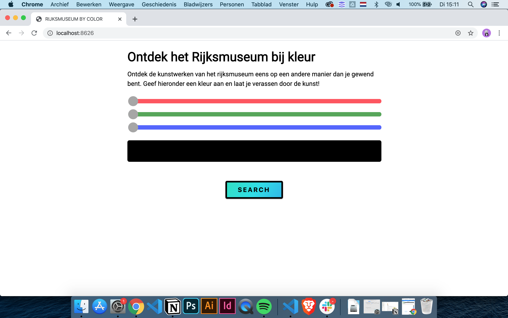

# 🎓 Progressive Web Apps 👨🏻‍💻 Marten de Bruijn



## Introductie

Applicatie van Webapp From Scratch (WAFS) om zetten tot een server side-render applicatie met performanche enhancements. Zie de wiki voor uitgebreidere uitleg. Documentatie van de webapplictatie van WAFS kan men [hier](https://github.com/martendebruijn/web-app-from-scratch-1920) vinden.

## Live Demo

[Live Demo](https://pwa-marten-de-bruijn.herokuapp.com/)

## Table of Contents

- [Usage](#Usage)
- [PWA](#pwa)
- [Performance Enhancements](#Performance-enhancements)
- [Whishlist](#Whishlist)
- [Sources](#Sources)

## Usage

```
git clone https://github.com/martendebruijn/progressive-web-apps-1920.git
cd progressive-web-apps-1920
npm install
npm start
```

## PWA

Door middel van een manifest en service worker kan men de app installeren en gebruiken als een applicatie. In de service worker cachen we shell assets en dynamische assets. Zie wiki voor een uitgebreidere uitleg.

## Performance Enhancements

Ik heb gebruik gemaakt van de volgende enhancements:

- Server Side Rendering i.p.v. Client Side Rendering
- Eigen icons gebruiken i.p.v. Font Awesome
- Ruimte reserveren voor afbeeldingen (skeleton design)
- Service Worker
- Minifying

### Caching

Caching doe ik nog enkel in de service worker. Echter wordt een service worker nog niet overal ondersteund. Hierdoor moet men nog wel een andere manier van caching toevoegen. \

### Compressie

Het lukte mij wel om d.m.v. Gulp HTML, CSS, JS en IMG bestanden te comprimeren. Echter kreeg ik het niet voor elkaar om de gecomprimeerde bestanden vervolgens te gebruiken in de webapp.

## Wishlist

- [ ] Browser-Caching
- [ ] [Gulp eslint](https://www.npmjs.com/package/gulp-eslint)
- [ ] Compression GZIP en Br
- [ ] Code Splitting
- [ ] Font Loading
- [ ] Blocking Font Loading
- [ ] Critical CSS
- [ ] Load Styles Async (- if - needed -)

## Sources

Onderstaand een lijst van de meest gebruikte tools en bronnen.

- 🛠 = Tool
- 📖 = Article / Documentation
- 📹 = Video
- ⚙️ = Code

- 📖 [Expressjs Guide](https://expressjs.com/en/guide/routing.html)
- 📖 [MDN Web Docs - Manifest.json](https://developer.mozilla.org/en-US/docs/Mozilla/Add-ons/WebExtensions/manifest.json)
- 📹 [PWA Tutorial for Beginners - The Net Ninja - Youtube](https://www.youtube.com/watch?v=4XT23X0Fjfk&list=PL4cUxeGkcC9gTxqJBcDmoi5Q2pzDusSL7)
- 📖 [Gulp Documentation](https://gulpjs.com/docs/en/getting-started/quick-start)
- ⚙️ [Gulp 4 sample file](https://gist.github.com/jeromecoupe/0b807b0c1050647eb340360902c3203a)
- 🛠 [Can I use?](https://caniuse.com/)
